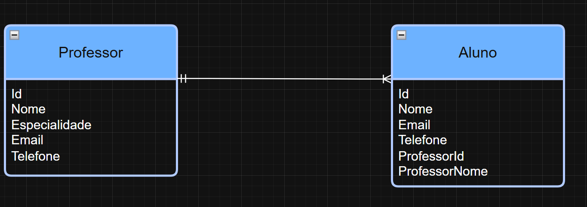

# Sistema Academia Boxe

## Descrição do Projeto

O Sistema Academia Boxe é uma aplicação web desenvolvida para gerenciamento de alunos e professores de uma academia de boxe.

O sistema permite:

- Cadastro de alunos
- Cadastro de professores
- Edição de alunos e professores
- Exclusão de alunos e professores
- Pesquisa dinâmica sem recarregar a página
- Relacionamento entre alunos e professores

O projeto foi desenvolvido utilizando ASP.NET Core Web API no backend, MongoDB como banco de dados e HTML/CSS/JavaScript no frontend.

---

# Tecnologias Utilizadas

- C#
- ASP.NET Core Web API
- MongoDB Atlas
- HTML
- CSS
- JavaScript
- Swagger

---

# Pre-requisitos

É necessário ter instalado:

- .NET 8 SDK
- Visual Studio Code ou Visual Studio
- MongoDB Atlas
- Navegador Web
- Extensão Live Server (VS Code)

---

## Relacionamento entre Entidades

O sistema possui relacionamento entre alunos e professores.

A relação utilizada é de 1 para N:

- Um professor pode possuir vários alunos.
- Um aluno possui apenas um professor responsável.

No cadastro de alunos, o sistema realiza uma busca dos professores cadastrados na API e exibe esses professores em um campo de seleção (`select`) no frontend.

O usuário seleciona manualmente o professor responsável pelo aluno durante o cadastro.

Ao salvar um aluno, o sistema armazena:

- ProfessorId
- ProfessorNome

Isso permite identificar corretamente qual professor está vinculado ao aluno, fortalecendo o relacionamento entre as entidades do sistema.

## Diagrama do Relacionamento

A imagem abaixo representa o relacionamento entre professores e alunos no sistema:


## Exemplo de Estrutura

```json
{
  "nome": "João",
  "email": "joao@email.com",
  "telefone": "99999-9999",
  "professorId": "id-do-professor",
  "professorNome": "Professor Exemplo"
}
```

---
# Como Executar o Projeto

## 1. Clone o repositório

```bash
git clone https://github.com/MatheusCesarMC/academia-boxe-api.git
```

---

## 2. Abra o projeto

Abra a pasta do projeto no VSCODE.

---

## 3. Configure o appsettings.Development.json

Adicione sua string de conexão MongoDB:

```json
{
  "MongoDbSettings": {
    "ConnectionString": "SUA_STRING_DE_CONEXAO",
    "DatabaseName": "academia",
    "CollectionName": "alunos"
  }
}
```

---

## 4. Execute a API

No terminal:

```bash
dotnet run
```

A API será iniciada em:

```text
http://localhost:5126
```

---

# Swagger

Após executar a API, acesse:

```text
http://localhost:5126/swagger
```

Use o Swagger para testar todos os endpoints da aplicação.

---

# Frontend

Para executar o frontend:

1. Abra a pasta frontend
2. Clique com botão direito no arquivo index.html
3. Selecione "Open with Live Server"

---

# Funcionalidades

## Alunos

- Criar aluno
- Listar alunos
- Editar aluno
- Excluir aluno
- Pesquisar aluno

## Professores

- Criar professor
- Listar professores
- Editar professor
- Excluir professor
- Pesquisar professor